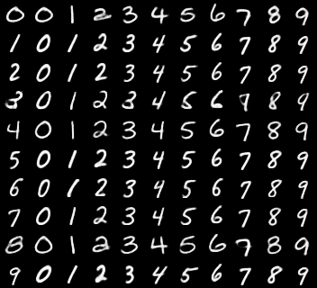
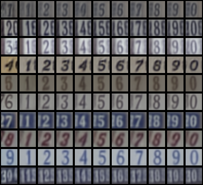

# Generative Models

## SSL-VAE
PyTorch implementation of the method described in [Semi-Supervised Learning with Deep Generative Models](https://arxiv.org/abs/1406.5298).

### MNIST

|                          |  N=100   |   N=1000 |
|:------------------------:|:--------:|:--------:|
|  Paper M2                |  88.03%  |  96.40%  |
|  My impl. M2             |  92.85%  |  96.72%  |
|  Paper M1+M2             |  96.67%  |  97.60%  |
|  My impl. M1+M2          |  97.20%  |  97.55%  |

#### M1+M2 analogies using N=100:

|  |
|:---:|
| *(The original samples are in the first column)* |

### SVHN
I could achieve reliable results only when I increased the classification weight to $\alpha=0.5$. The following result is the average of three runs.

|                          |  N=1000  |
|:------------------------:|:--------:|
|  Paper M1+M2             |  63.98%  |
|  My impl. M1+M2          |  73.20%  |

#### M1+M2 analogies using N=1000:

|  |
|:---:|
| *(The original samples are in the first column)* |

